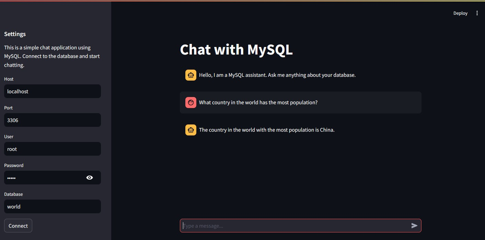

# SQL Database Chatbot Assistant

A conversational chatbot designed to interact with a MySQL database and extract information using natural language.

<p align="center">
  
  <br>
  <em>MySQL Chatbot User Interface</em>
</p>


## How to Run
1. Make sure that MySQL is installed in your local computer. Download it from https://dev.mysql.com/downloads/installer/.

    a. Optional Step: Open `MySQL Workbench` and log in to your local instance. You can see a database called `world`. We will use this database or you can create a new one.

<p align="center">
  
  <br>
  <em>Sample Database</em>
</p>

2. Ensure that you have created a `.env` file containing the key-value pair below. This connects the chatbot to the OpenAI ChatGPT model service.
```
OPENAI_API_KEY=<your-openai-api-key>
```
- To create an OpenAI API key:
  - Sign up to OpenAI: https://openai.com/api/
  - Purchase credits (minimum purchase is $5)
3. Install the necessary requirements using the command:
```
pip install -r requirements.txt
```
4. Run the streamlit app
```
streamlit run src/app.py
```


## How it Works
1. The app uses Streamlit for the user interface.
2. When a user submits a question, the app uses OpenAI's GPT-3.5-turbo model to generate an appropriate SQL query.
3. The generated SQL query is executed on the connected MySQL database.
4. The results are then passed back to the language model to generate a natural language response.
5. The response is displayed in the chat interface.

